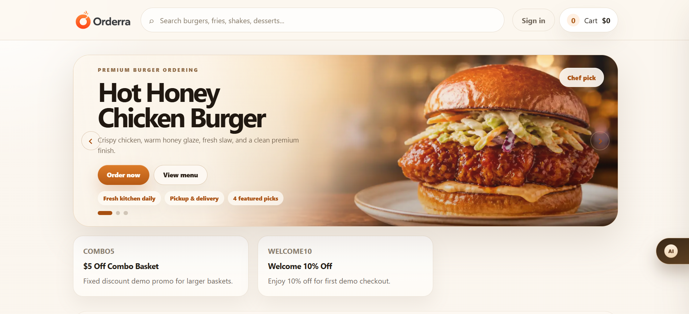
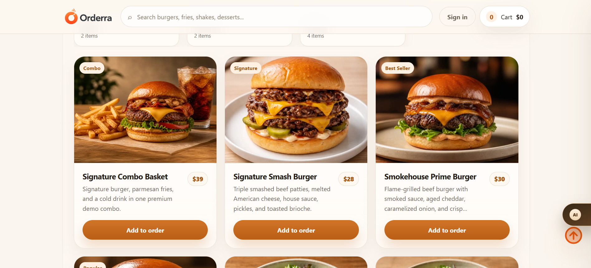
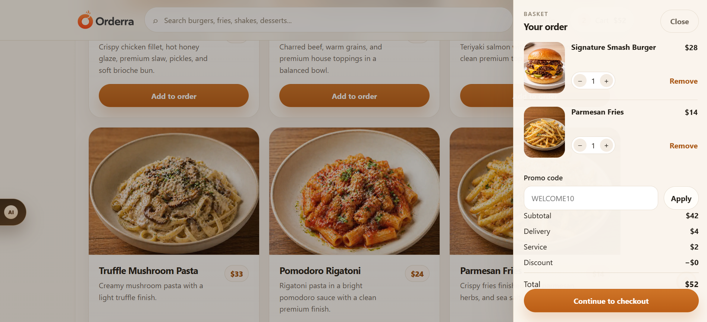
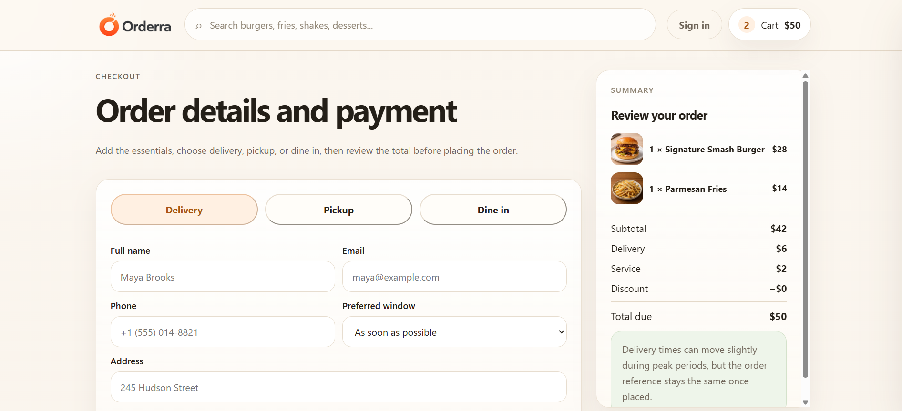
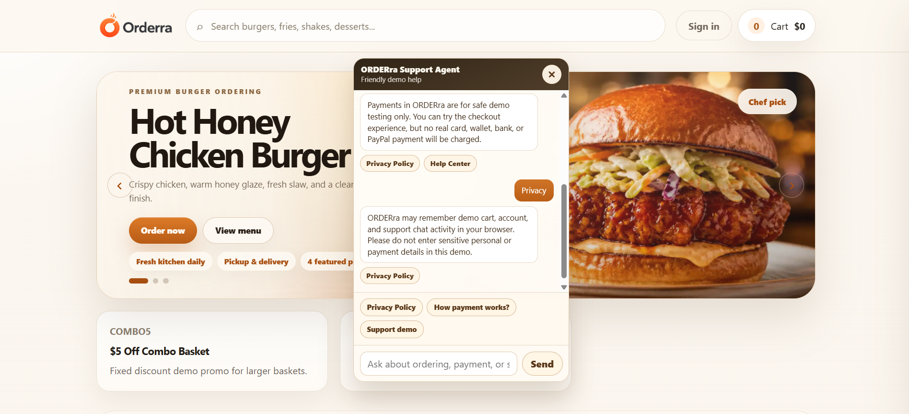

# ORDERra v2

ORDERra v2 is a **premium single-restaurant ordering demo** built as a portfolio-ready progressive web experience.
It showcases a coherent **backend-first Laravel API**, a **React + TypeScript + Vite** customer app, staff authentication, dine-in QR sessions, simulated payments, refunds, rider milestones, Ops webhooks, Help Center, Privacy Policy, controlled demo AI Support, and an operations-focused admin hub.

---

## Tech stack

| Layer        | Choice                                                              |
| ------------ | ------------------------------------------------------------------- |
| API          | Laravel 11 (REST under `/api/v1`)                                   |
| Admin auth   | Bearer tokens (staff / Sanctum) + optional reference key middleware |
| Customer app | React 18, TypeScript, Zustand, Vite                                 |
| Storage      | SQLite in local demo (swap for Postgres/MySQL in production)        |

---

## Demo-safe payments (critical)

ORDERra ships with **explicit demo payment guards**:

- `PAYMENTS_DEMO_MODE=true` and `PAYMENTS_BLOCK_LIVE_EXECUTION=true` keep the stack on simulated providers.
- Customer payment flows call **simulation** endpoints only; there is **no real card capture, no live PSP execution, and no payouts**.

Do **not** disable these flags for the public portfolio build.

---

## Core features (what to highlight in a portfolio)

- Menu catalog with category filters, promos, and checkout (delivery, pickup, dine-in).
- Server-backed cart, pricing quote, checkout, and order placement.
- **Dine-in QR**: short URL under `/qr/{sessionCode}` (SPA) resolving to an active table session; cart attach + contextual checkout.
- **Admin**: dashboard metrics, orders, kitchen board, table QR management (per-table rotate), payment/refund/webhook/support/audit ledgers, rider directory + assignments, demo scenario map, settings reference (branches, zones, tax, fees).
- **Support experience**: Help Center, Privacy Policy, controlled demo AI Support, smart internal CTA buttons, and demo-only human support handoff card.
- **PWA**: `manifest.webmanifest`, installable shell, and a minimal service worker that **does not cache API responses** (static assets only via the browser’s normal HTTP cache).

---

## Screenshots

### Homepage hero



### Menu product grid



### Cart drawer



### Checkout and payment flow



### AI Support open panel



More portfolio captures can be added later:

1. Confirmation / order timeline
2. Admin dashboard
3. Table QR management

---

## Local setup

### Prerequisites

- PHP 8.2+, Composer
- Node 20+ (LTS recommended)
- SQLite (default) or configure `.env` for your database

### Backend

```bash
cd backend
composer install
cp .env.example .env
php artisan key:generate
touch database/database.sqlite   # Windows: New-Item database/database.sqlite
php artisan migrate --seed
php artisan serve --host=127.0.0.1 --port=8000
```

Seeded demo logins (rotate passwords if you expose this beyond localhost — see `.env.example`):

- Admin: **admin@orderra.test** / **password**
- Staff: **staff@orderra.test** / **password**
- Customer: **customer@orderra.test** / **password**

### Frontend

```bash
cd frontend
cp .env.example .env   # configure VITE_API_BASE_URL / VITE_DATA_MODE
npm install
npm run dev
```

Use `VITE_DATA_MODE=api` (or legacy `http`) so the SPA talks to Laravel. QR join links use `FRONTEND_URL` from the Laravel `.env` when minting URLs.

---

## Commands (cheat sheet)

| Task                      | Command                                          |
| ------------------------- | ------------------------------------------------ |
| Frontend install          | `cd frontend && npm install`                     |
| Frontend production build | `cd frontend && npm run build`                   |
| Frontend lint             | `cd frontend && npm run lint`                    |
| Backend routes            | `cd backend && php artisan route:list`           |
| Backend tests             | `cd backend && php artisan test`                 |
| Reseed dine-in QR         | `cd backend && php artisan migrate:fresh --seed` |

---

## Known demo limitations

- **Fulfillment carriers & maps** are simulated; ETA values are illustrative.
- **Printing QR** relies on browser print dialogs; enterprise venues would pipe through a PDF microservice.
- **Static hosts** serving the SPA must rewrite unknown paths to `index.html`, or `/qr/...` deep links will 404.
- Asset pipeline for menu photography expects WebP drops under `frontend/public/media/menu` (matching catalog slugs).

---

## Clean portfolio handoff / GitHub hygiene

ORDERra is a demo portfolio project, but the handoff archive should still be clean and reviewer-safe.

Use the generated clean archive for portfolio sharing, backups, and GitHub handoff:

```bash
python build_project.py
python check_zip_clean.py
```

Expected result:

```txt
CLEAN
```

The generated archive is:

```txt
project_jutawan.zip
```

### What the clean archive excludes

`project_jutawan.zip` must not include:

- `.env` or `.env.*` files, except `.env.example`
- `frontend/node_modules/`
- `backend/vendor/`
- `frontend/dist/`
- build/cache files such as `.tsbuildinfo`
- PHPUnit cache files
- local SQLite database files
- Laravel logs
- Laravel runtime cache/session/view output
- generated build artifacts

### Raw working zip vs clean handoff zip

A raw local working zip may contain dependencies, local environment files, build output, logs, or a local SQLite database.

That is acceptable for private local development, but it is not suitable for:

- GitHub upload
- public portfolio sharing
- client handoff
- long-term backup
- reviewer submission

For public sharing, always regenerate and verify:

```bash
python build_project.py
python check_zip_clean.py
```

To audit a specific zip manually:

```bash
python check_zip_clean.py path/to/archive.zip
```

If blocked files are found, the script prints:

```txt
NOT CLEAN
```

### GitHub upload checklist

Before pushing or sharing ORDERra:

1. Confirm `.env` files are not included.
2. Keep `.env.example` files.
3. Do not commit `node_modules/`.
4. Do not commit `vendor/`.
5. Do not commit `frontend/dist/`.
6. Do not commit SQLite local database files.
7. Do not commit Laravel logs/cache/session/view runtime output.
8. Run `python check_zip_clean.py` before sharing the generated archive.

### Demo safety reminder

ORDERra must remain demo-safe:

- no real payment charge
- no live payment capture
- no real payout
- no live webhook provider dependency
- no real rider dispatch
- no production payment keys

Payment, refund, webhook, rider, QR, AI Support, human support handoff, support ticket, and admin operations are simulation/reference flows only.

---

## Final verification checklist

Use this checklist before sharing ORDERra as a portfolio project, GitHub backup, or reviewer handoff.

ORDERra should remain demo-safe and clean:

- no `.env` files in public archive
- no `node_modules/`
- no `vendor/`
- no `frontend/dist/`
- no local SQLite database
- no Laravel logs/cache/session/view runtime output
- no production payment provider keys
- no real payment capture
- no real payout
- no live webhook provider dependency
- no real rider dispatch
- no real AI API call
- no real human support handoff
- no real support ticket API call

### 1. Backend verification

From the backend folder:

```bash
cd backend
php artisan route:list --path=api
php artisan test
```

Expected:

- API routes load successfully
- payment demo guard tests pass
- no real payment/provider execution is required
- no missing migration/model/controller error appears

### 2. Frontend verification

From the frontend folder:

```bash
cd frontend
npm run build
```

Expected:

- TypeScript build passes
- Vite build completes
- customer flow pages compile
- admin/staff portal pages compile
- demo AI assistant module compiles if included

### 3. Clean portfolio zip verification

From the project root:

```bash
python build_project.py
python check_zip_clean.py
```

Expected:

```txt
CLEAN
```

The generated archive is:

```txt
project_jutawan.zip
```

Use this archive for portfolio sharing or reviewer handoff.

### 4. GitHub backup verification

From the project root:

```bash
python scripts/prepare_github_backup.py
python check_zip_clean.py ../orderra-v2-github-clean.zip
```

Expected:

```txt
CLEAN
```

Use this zip only as a clean GitHub backup/handoff archive.

### 5. Raw working zip audit

If auditing a raw local working zip:

```bash
python check_zip_clean.py ../orderra-v2.zip
```

A raw working zip may return:

```txt
NOT CLEAN
```

That is expected if it contains local development files such as dependencies, `.env`, build output, logs, or SQLite database files.

Do not upload raw working zip files to GitHub or public portfolio pages.

### 6. Customer flow smoke test

Manually test:

1. Open menu.
2. Add item to cart.
3. Open cart drawer.
4. Go to checkout.
5. Test delivery payment success.
6. Test delivery payment failed.
7. Test delivery payment pending.
8. Test pickup flow.
9. Test dine-in table reference flow.
10. Test split bill preview.
11. Confirm back-to-menu behavior after confirmation.

Expected behavior:

- success can create confirmation
- failed payment does not create order
- pending payment does not create confirmed order
- pickup keeps delivery fee at zero
- dine-in validates table/session context
- wording remains demo-safe

### 7. Admin / staff smoke test

Manually test:

1. Admin login.
2. Staff login.
3. Dashboard loads.
4. Order list loads.
5. Kitchen board loads.
6. Order detail transition works.
7. Payments reference page loads.
8. Refunds reference page loads.
9. Webhooks reference page loads.
10. Riders / assignments reference pages load.
11. Support page loads.
12. Audit logs page loads.
13. Settings reference pages load.
14. Staff restricted route recovery works.
15. Mobile/tablet admin nav remains usable.

Expected behavior:

- admin-only areas stay protected
- staff restricted route recovery is clear
- demo simulator does not execute real actions
- reference pages have clean empty/loading/error states

### 8. Demo safety check

Before presenting ORDERra, confirm:

```env
PAYMENTS_DEMO_MODE=true
PAYMENTS_BLOCK_LIVE_EXECUTION=true
PAYMENTS_ALLOW_WEBHOOK_SIMULATION=true
PAYMENTS_SAFE_PROVIDER_MODES=demo,sandbox,test
PAYMENTS_DEMO_PROVIDER_DRIVERS=demo
```

Do not present ORDERra as:

- live payment processing software
- production payment gateway
- live dispatch platform
- PCI-ready card processing system
- real payout system
- real AI support service
- live support ticketing system
- real human agent service

Safe wording:

> ORDERra is a demo-safe restaurant ordering platform with simulated payment, refund, webhook, rider, QR, AI Support, human support handoff, support ticket, and admin operations.

---

## Further reading

- [docs/README.md](docs/README.md) — documentation index and recommended reading order
- [docs/PORTFOLIO_NOTES.md](docs/PORTFOLIO_NOTES.md) — portfolio positioning, architecture story, and production caveats
- [docs/demo-safety-rules.md](docs/demo-safety-rules.md) — demo safety rules for payment, refund, webhook, rider, QR, support, and admin simulation
- [docs/API_OVERVIEW.md](docs/API_OVERVIEW.md) — route grouping summary
- [docs/FINAL_QA_SIGNOFF.md](docs/FINAL_QA_SIGNOFF.md) — final QA checklist, including Help Center, Privacy Policy, and controlled demo AI Support checks
